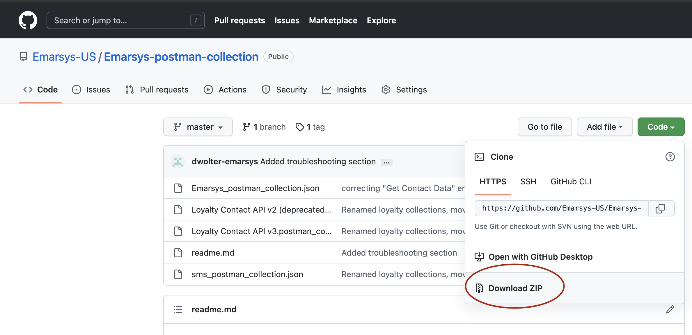
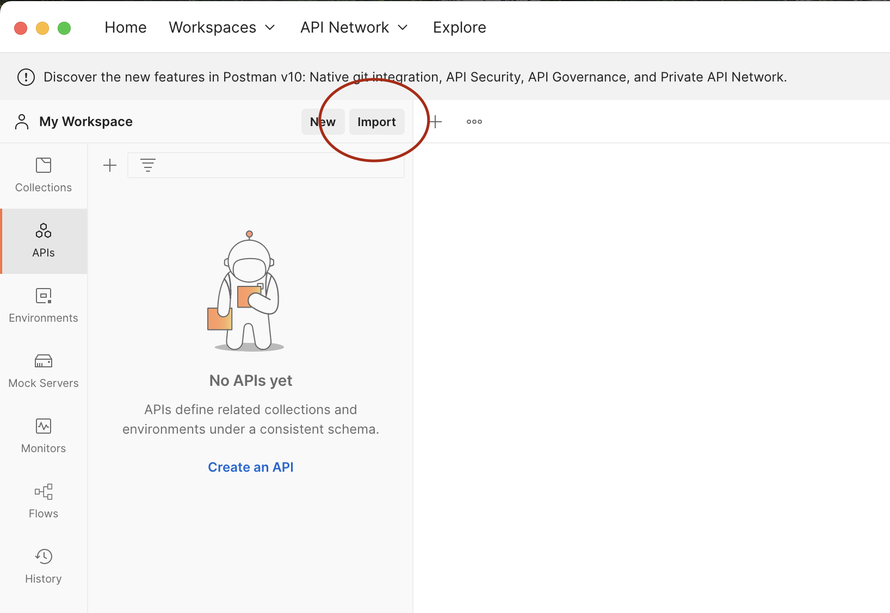
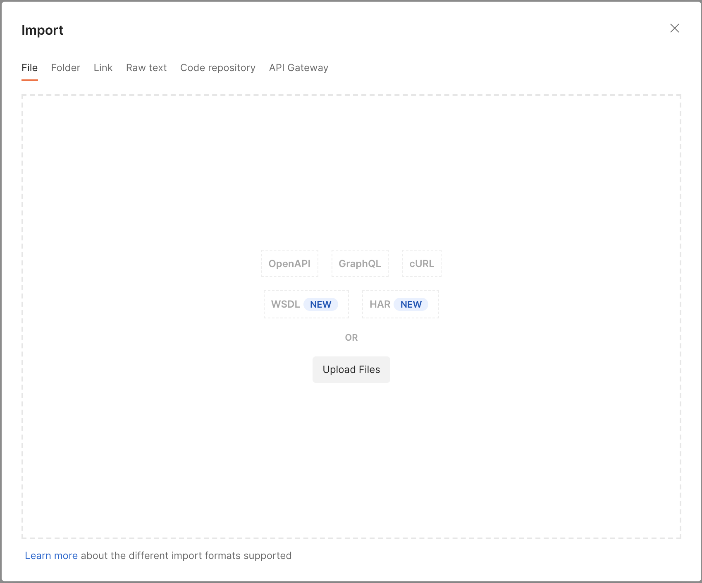
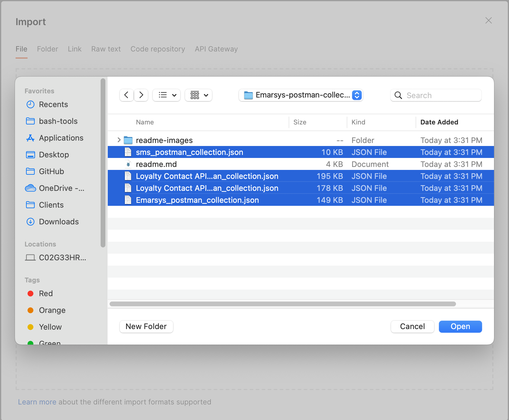
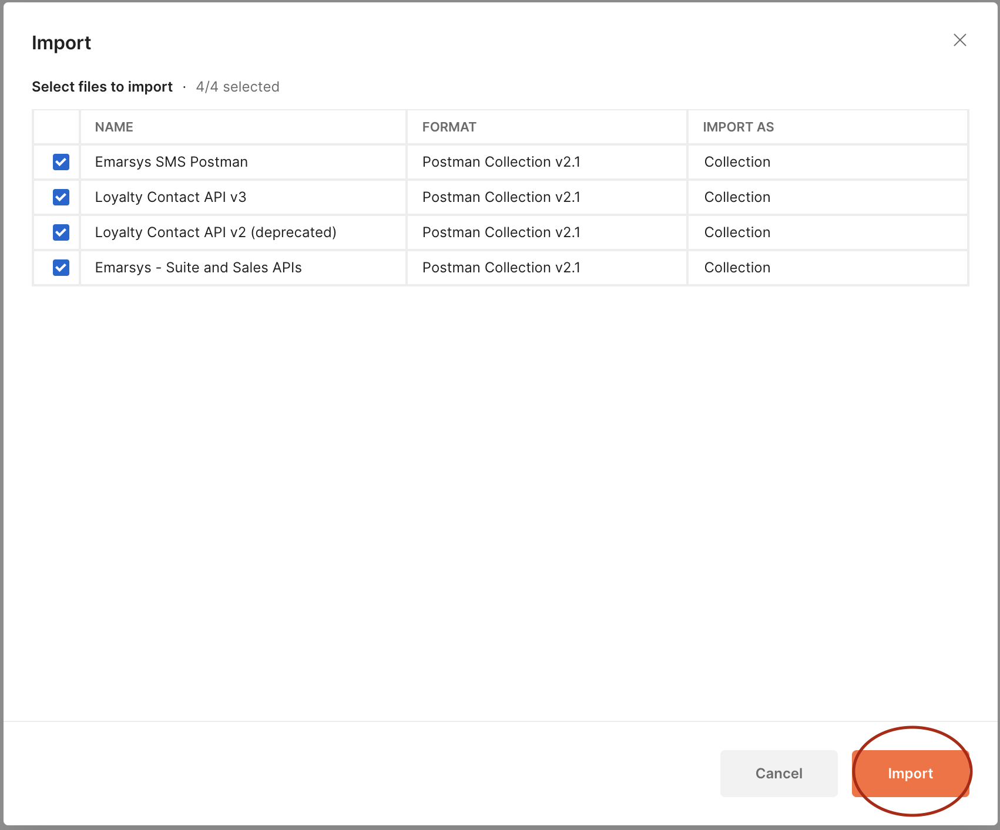
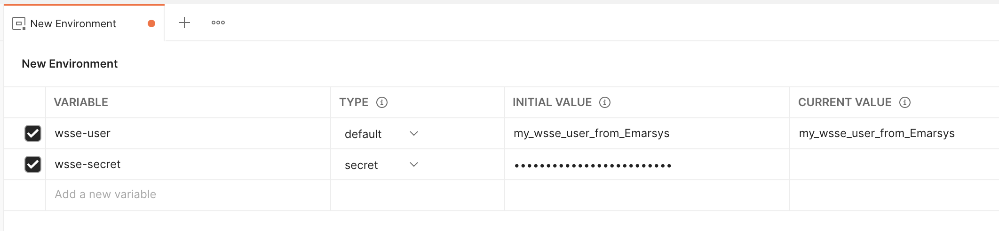
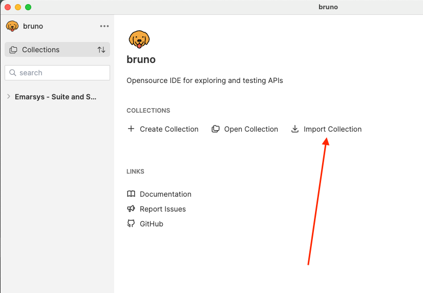
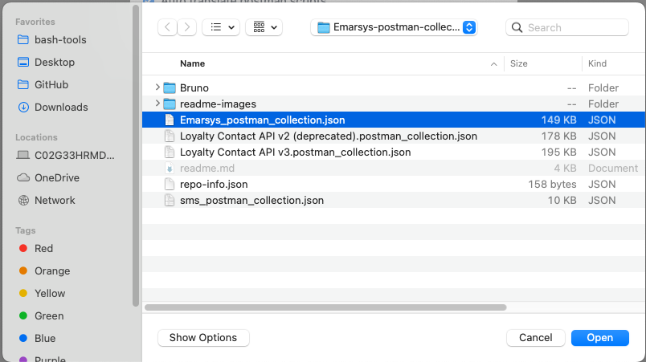
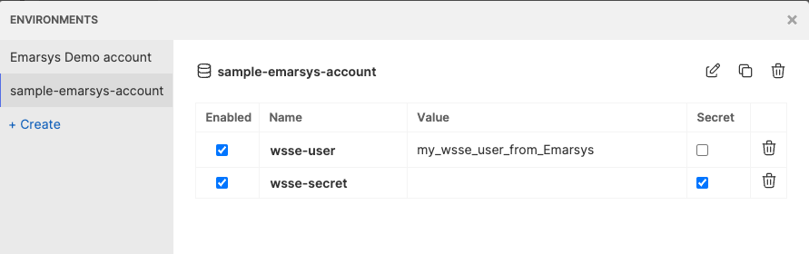

# Emarsys API Postman collections
This repo provides updates to the Emarsys Postman collections for:
- Contact / Email management and sales data uploads (suite)
- Loyalty
- SMS

## For a free alternative to Postman, this collection is also compatible with Bruno, as described [here](#Using-this-collection-with-Bruno).

## How to install
1. First, make sure you have Postman installed. These collections are meant to be used with the program Postman, which can be downloaded here: https://www.postman.com/downloads/
1. Download this repository by clicking on the Green "Code" button at the top of this page, then "Download Zip":
  
3. Extract the files from the .zip folder
4. With Postman installed and the collections downloaded, click on the import button in the top-left:
  
1. Select The upload files option:
    
1. Select each of the files from the downloaded package (The readme.md and readme-images folder are okay to select too, but aren't necessary)
    
1. Finally, select the import button to confirm and the package will be fully installed!
  
 

## Configuration

This version of the Postman collections use Postman Environment Variables to manage the credentials for the account(s) you work with.

[This guide goes over how to create those environments](https://learning.postman.com/docs/sending-requests/managing-environments/#creating-environments)

If you work with multiple Emarsys accounts, use a separate Postman Environment for each account.

The required variables for your environment will depend on which APIs you use:

### Suite APIs/ SMS APIs:
- wsse-user
- wsse-secret
  - These values are provided when creating an API user in Emarsys
  - Please make sure your API user has the correct Permissions selected in Emarsys to allow for the API call you're testing
  - Note that the value that gets used in the API calls themselves is "wsse-header" - that value is derived from the other two variables above

### Sales uploads (part of the Suite APIs):
- sales-bearer-token
- sales-merchant-id
  - Each found in the Predict Data Sources section of your Emarsys account

### Loyalty:
- loyalty-api-key

## Troubleshooting

### Requests aren't being authenticated, wsse-header value in X-WSSE headers is marked as an "Unresolved Variable"
- This Postman collection will generate the wsse-header variable for you, but sometimes Postman doesn't see the variables in your environment at immediately. To fix this, simply save what you're doing and restart Postman
- If restarting doesn't solve the issue, double-check that the API call you're trying to make is from inside the provided environment. The environment itself contains the logic for authenticating requests and generating the X-WSSE header, so a request that is executed outside the context of this environment would have no authentication logic

# Using this collection with Bruno

[Bruno](https://docs.usebruno.com/) is an open-source API tool that is very similar to Postman, but is fully free to use and is supported by the Open-Source community.

This collection can be used with Bruno, with the following steps:

1. Make sure you have Bruno installed. You can download Bruno here: https://www.usebruno.com/downloads
1. Download this repository by clicking on the Green "Code" button at the top of this page, then "Download Zip":

    

1. Extract the files from the .zip folder
1. With Bruno downloaded and the collections downloaded, click on the Import Collection button:

    

1. Select "Postman Collection" for the collection type
1. Select the file "Emarsys_postman_collection.json" from the files you downloaded previously and press open:

    

1. Bruno will then ask you where you'd like to save the imported collection. Select any location on your computer you would like to store your work in Bruno
1. Repeat for the files "sms_postman_collection.json" and "Loyalty Contact API v3.postman_collection.json" if desired.

1. After your first installation, follow the steps for configuring your environments in the next section before sending your first request

## Configuring Bruno for Suite APIs/ SMS APIs:

Unlike Postman, Bruno has direct support for the WSSE authentication which is used for the Emarsys contact and SMS APIs. Before sending a request, open the Auth tab, select WSSE from the dropdown, and enter your API user and Secret.

- These values are provided when creating an API user in Emarsys
- Please make sure your API user has the correct Permissions selected in Emarsys to allow for the API call you're testing

The required variables for your environment will depend on which APIs you use:

## Configuring Bruno for other Emarsys APIs

This collection uses Bruno Environment Variables to manage the credentials for the account(s) you work with.

[This guide goes over how to create those environments](https://docs.usebruno.com/secrets-management/secret-variables)

### Sales uploads (part of the Suite APIs):
- sales-bearer-token
- sales-merchant-id
  - Each found in the Predict Data Sources section of your Emarsys account

### Loyalty (V2 and V3):
- loyalty-api-key

## Bruno-specific notes

1. Bruno doesn't support "path parameters" which are parts of the link before the question mark that can be changed to determine what data you retrieve. These parameters are marked with a colon and then the parameter name (such as ":languageId" in the Fields/List Available Fields API). To use these in Bruno, simply replace the colon and the name with the value you'd like to send in your API request